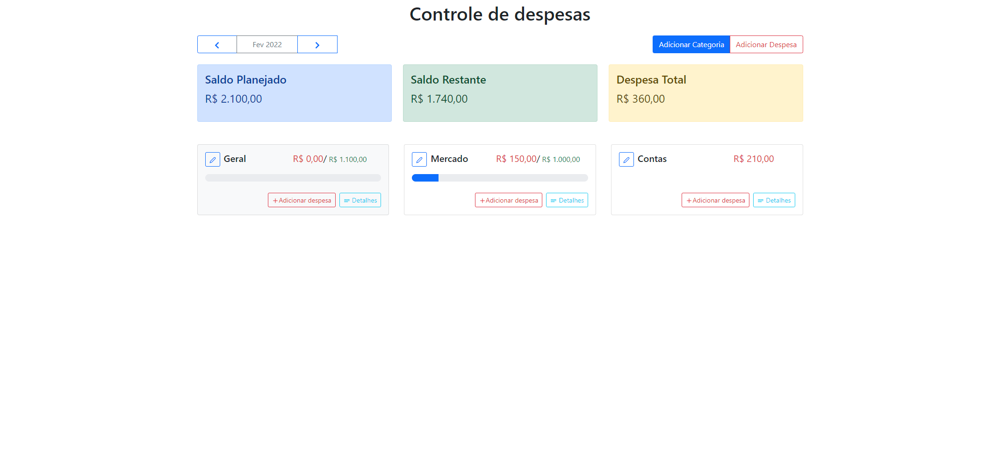

# Controle de despesas

> Um aplicativo CRUD no React é algo com o qual a maioria dos iniciantes luta, então nesse projeto criei um aplicativo CRUD simples construído em torno do orçamento e despesas. Este é um projeto divertido, pois abrange muitos conceitos React de nível intermediário e iniciante que se juntam para criar um projeto complexo.

## 💼 Tecnologias utilizadas
Para o desenvolvimento deste site utilizei as seguintes tecnologias:

- HTML;
- JavaScript;
- React
- Custom hooks
- Context api
- Prop drilling 
- Uuid
- React-bootstrap
---

### Ajustes e melhorias

O projeto ainda está em desenvolvimento e as próximas atualizações serão voltadas nas seguintes tarefas:

- [ ] Usar reducer no Context api
- [ ] Adicionar gráficos

## 📫 Contribuindo

Para contribuir, siga estas etapas:

1. Bifurque este repositório.
2. Crie um branch: `git checkout -b <nome_branch>`.
3. Faça suas alterações e confirme-as: `git commit -m '<mensagem_commit>'`
4. Envie para o branch original: `git push origin <nome_do_projeto> / <local>`
5. Crie a solicitação de pull.

Como alternativa, consulte a documentação do GitHub em [como criar uma solicitação pull](https://help.github.com/en/github/collaborating-with-issues-and-pull-requests/creating-a-pull-request).